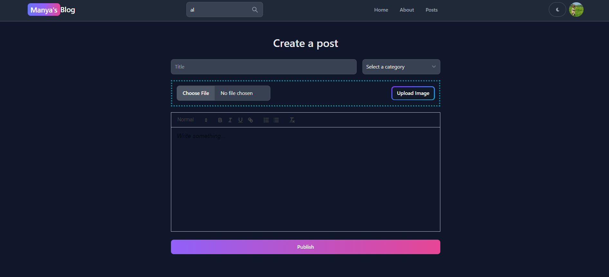

# Full Stack Blogging Application using MERN Stack

## Technologies used 
1. HTML
2. Tailwind CSS
3. JavaScript
4. React

- Node JS, Express JS and MongoDb is used for Backend server.

## Configuration and Setup

In order to run this project locally, simply fork and clone the repository or download as zip and unzip on your machine.

- Open the project in your prefered code editor.
- Go to terminal -> New terminal (If you are using VS code)
- Split your terminal into two (run the Frontend on one terminal and the Backend on the other terminal)

In the first terminal
- cd client and set your web-app's Firebase configuration
- Set environment variables in .env file in src folder
```
#  ---  .env  ---

VITE_FIREBASE_API_KEY=

```
```
# --- Terminal ---
$ cd client
$ npm install (to install frontend-side dependencies)
$ npm run dev (to start the frontend)
```

In the second terminal

- cd Backend and Set environment variables in .env file
- Create your mongoDB connection url, which you'll use as your MONGO (MongoDB URI)
- Supply the following credentials

```
#  ---  .env  ---

MONGO =
JWT_SECRET_KEY =

```


```
# --- Terminal ---

$ npm install (to install backend-side dependencies)
$ npm start dev (to start the backend)
```

##  Key Features

- Proper Landing page with recent Blogs
- User registration and login
- Authentication using JWT Tokens and OAuth
- Admin Dashboard
- Dark Mode
- Blog searching  and pagination
- Implemented a rich text editor for creating and formatting blog posts
- CRUD operations </br>
   &nbsp; &nbsp; &nbsp; &nbsp;    1) Blog create, read, update and delete </br>
   &nbsp; &nbsp; &nbsp; &nbsp;    2) Comment  create, read, update and delete </br>
   &nbsp; &nbsp; &nbsp; &nbsp;    3) Users create, read, update and delete </br>
- Upload user ımages and blog ımages to the server 
- Liking  stories
- Commenting  on the story
- Responsive Design

## Screenshots
## Home Page

<div style="text-align: center;">
  
  
</div>

## Blogs Listing Page

<div style="text-align: center;">
  
</div>

## Single Blog Page

<div style="text-align: center;">
  
</div>

## About Page

<div style="text-align: center;">
  
</div>

## Users Dashboard

<div style="text-align: center;">
  
</div>

## Admin Dashboard

<div style="text-align: center;">
  
</div>

## Create Post

<div style="text-align: center;">
  
</div>

## Comments Section

<div style="text-align: center;">
  
</div>
